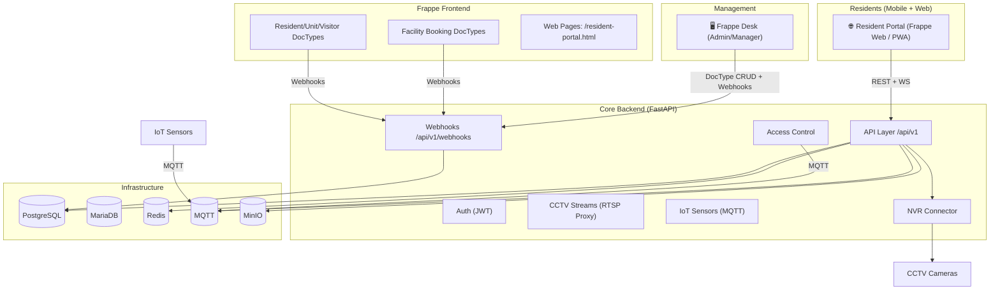

# CondoBuddy2 🖤

Smart Community Platform — Hybrid Architecture

**Frappe/ERPNext** (Management Portal + Resident Web UI) + **FastAPI Async Backend** (IoT, CCTV, Access Control)

---

## Architecture



---

## Key Decisions

| Component | Technology | Why |
|-----------|-----------|-----|
| **Management Portal** | Frappe/ERPNext | Facility booking, resident mgmt, reports, role-based access |
| **Resident Mobile** | Frappe Web (PWA) | Responsive, no separate app build, works on any phone |
| **Core Backend** | FastAPI + asyncpg | High-throughput IoT event handling, async RTSP proxy |
| **Database** | PostgreSQL (core) + MariaDB (Frappe) | Frappe needs MariaDB; core uses async PostgreSQL |
| **Cache/Queue** | Redis | Fast pub/sub, Celery broker, Frappe cache |
| **File Storage** | MinIO | S3-compatible, on-premise friendly |
| **CCTV** | RTSP Proxy (ffmpeg) | **No AI detection** — passive streaming only |
| **IoT** | MQTT + Sensor Alerts | Alert triggers from smoke/leak/motion sensors |
| **Facility Booking** | Frappe DocType | Built-in calendar, approval workflow, notifications |
| **Visitor Mgmt** | Frappe DocType | Pre-registration, QR code generation, access log sync |

---

## Quick Start

### Prerequisites

- Docker + Docker Compose
- Node.js (for E2E tests)
- Git

### 1. Clone & Start

```bash
git clone https://github.com/Amber201604/condoBuddy2.git
cd condobuddy2

# Start all services
docker-compose up -d

# Wait for Frappe to initialize. The first boot creates the site, installs the
# custom app, and configures roles automatically (this can take several minutes).
docker-compose logs -f frappe

# Once ready, access:
# Frappe Desk:     http://localhost:8080   (login: Administrator / admin)
# Resident Portal: http://localhost:8080/resident-portal.html
# FastAPI Docs:    http://localhost:8000/docs
# FastAPI Health:  http://localhost:8000/health
# MinIO Console:   http://localhost:9001    (minioadmin / minioadmin)
```

Service ports:

| Service | Host port | Notes |
|---------|-----------|-------|
| Core (FastAPI) | 8000 | API + Swagger docs |
| Frappe | 8080 | Desk + Resident Portal |
| Frappe Bridge | 8002 | Frappe ↔ Core sync |
| PostgreSQL | 5432 | Core database |
| Redis | 6379 | Cache / Celery / Frappe |
| MinIO | 9000 (API), 9001 (console) | Object storage |
| MQTT | 1883 (mqtt), 9883 (websockets) | IoT broker |

### 2. Configure Frappe (automatic)

The Frappe container's entrypoint performs first-boot setup for you on `docker-compose up`:

- Creates the `condobuddy2.local` site (Administrator password: `admin`)
- Installs the `condobuddy2_erp` app
- Points the site at the Core backend (`condobuddy_core_url`)

To re-run any of these manually (or to add more roles), exec into the container:

```bash
docker-compose exec frappe bash
cd /home/frappe/frappe-bench
bench --site condobuddy2.local install-app condobuddy2_erp
bench --site condobuddy2.local set-config condobuddy_core_url "http://core:8000"
```

### 3. Database Schema (Core Backend)

The Core backend **auto-creates its PostgreSQL tables on startup** (via SQLAlchemy
`create_all`), so no manual migration step is required for a fresh environment.

> Note: Alembic is listed as a dependency but no migration scripts are wired up
> yet. Once they exist, apply them with:
>
> ```bash
> docker-compose run --rm core alembic upgrade head
> ```

---

## Project Structure

```
condobuddy2/
├── frappe/
│   ├── Dockerfile                    # Frappe container image
│   ├── docker/
│   │   ├── entrypoint.sh             # Bench init + start
│   │   └── mariadb.cnf               # MariaDB charset config
│   └── apps/
│       └── condobuddy2_erp/          # 🆕 Custom Frappe App
│           ├── condobuddy2_erp/
│           │   ├── doctype/          # DocTypes: Unit, Resident, Facility, Booking, Visitor, Access Log, CCTV Alert, Package, IoT Sensor
│           │   ├── api/              # Whitelisted API methods
│           │   ├── www/              # Web pages (resident-portal.html)
│           │   ├── public/           # CSS, JS, images
│           │   ├── tests/            # Frappe unit + integration tests
│           │   └── hooks.py          # Webhooks, scheduled tasks
│           ├── setup.py
│           └── requirements.txt
├── core/                             # FastAPI async backend
│   ├── app/
│   │   ├── routers/                  # API + Webhook routers
│   │   ├── models/                   # SQLAlchemy models
│   │   ├── schemas/                  # Pydantic schemas
│   │   ├── services/                 # Business logic
│   │   └── main.py                   # FastAPI app
│   ├── tests/                        # pytest unit + integration tests
│   ├── Dockerfile
│   └── requirements.txt
├── frappe-bridge/                    # Frappe ↔ Core sync service
├── nvr-connector/                    # RTSP stream proxy
├── e2e/                              # 🆕 Cypress E2E tests
│   ├── cypress/
│   │   ├── e2e/                      # Test specs
│   │   └── support/
│   ├── cypress.config.js
│   └── package.json
├── docker-compose.yml
└── README.md
```

---

## Testing

### Unit Tests (Frappe)

```bash
# Inside Frappe container
docker-compose exec frappe bash
bench --site condobuddy2.local run-tests --app condobuddy2_erp
```

### Unit Tests (Core Backend)

```bash
cd core
python -m pytest tests/ -v
```

### Integration Tests (Core Backend)

```bash
cd core
python -m pytest tests/test_integration.py -v
```

### E2E Tests (Cypress)

```bash
cd e2e
npm install

# Open Cypress UI
npm run cypress:open

# Run headless
npm run cypress:run
```

---

## Webhook Flow (Frappe ↔ FastAPI)

```
Frappe DocType Event
    ↓
  hooks.py  →  on_submit / on_update
    ↓
  POST http://core:8000/api/v1/webhooks/facility-booking
    ↓
FastAPI webhook router
    ↓
  Core database / MQTT / Notifications
```

Supported webhooks:
- `POST /api/v1/webhooks/facility-booking` — Facility booking created/cancelled
- `POST /api/v1/webhooks/visitor` — Visitor pre-registered
- `POST /api/v1/webhooks/iot-alert` — IoT sensor alert
- `POST /api/v1/webhooks/access-log` — Access control event

---

## CCTV — NO AI Detection

CCTV streams are **passive RTSP proxies** only. No computer vision, no AI. Alerts come from dedicated IoT sensors (smoke, motion, door sensors) via MQTT.

---

## Mobile — No Separate App Needed

Frappe's web pages are fully responsive. Add to home screen on iOS/Android for a PWA-like experience. If a native app is needed later, Frappe's REST API can power any mobile client.

---

## License

MIT
