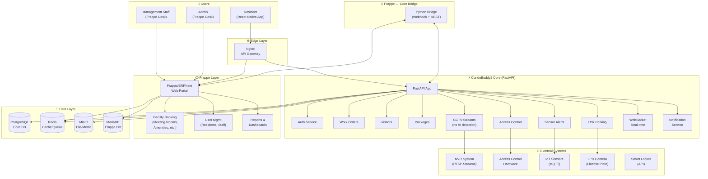

# CondoBuddy2 — Hybrid Architecture

## Overview

CondoBuddy2 adopts a **hybrid architecture**:
- **Core Async Backend** (Python/FastAPI) — handles IoT, CCTV, access control, work orders, real-time WebSocket
- **Frappe/ERPNext** — management web portal, facility booking (meeting rooms, amenities), user management
- **React Native Mobile** — resident app (iOS/Android)
- **NVR Connector** — RTSP stream proxy, no AI detection on CCTV

---



---

## Key Design Decisions

| Decision | Rationale |
|----------|-----------|
| **CCTV: no AI detection** | User explicitly requested. CCTV is passive streaming + manual monitoring. Alerts come from IoT sensors, not video AI. |
| **Facility booking in Frappe** | Frappe has robust booking/reservation modules. Reuse instead of reinventing. |
| **Hybrid data: PostgreSQL + MariaDB** | Core uses PostgreSQL (async-friendly). Frappe uses MariaDB (its native DB). Bridge syncs users/bookings. |
| **Bridge pattern** | Frappe and Core communicate via webhooks + REST. No tight coupling. Either can be swapped. |
| **Smart Locker as addon** | Exposed via Core API. Easy to add later without touching Frappe. |

---

## Tech Stack

| Layer | Tech |
|-------|------|
| Core API | Python 3.12, FastAPI, SQLAlchemy (async), WebSocket |
| Frappe Portal | Frappe Framework v15, ERPNext (optional) |
| Mobile App | React Native (Expo) |
| Message Queue | Redis + Celery |
| Databases | PostgreSQL 16, MariaDB 10.6, Redis 7 |
| Media Storage | MinIO (S3-compatible) |
| Deployment | Docker Compose |

---

## Project Structure

```
condobuddy2/
├── docker-compose.yml
├── README.md
├── docs/
│   └── architecture.md          # This file
│
├── core/                        # CondoBuddy2 Core (FastAPI)
│   ├── app/
│   │   ├── main.py
│   │   ├── config.py
│   │   ├── database.py
│   │   ├── dependencies.py
│   │   ├── core/
│   │   │   ├── security.py
│   │   │   ├── websocket.py
│   │   │   └── events.py
│   │   ├── models/
│   │   ├── schemas/
│   │   ├── routers/
│   │   │   ├── auth.py
│   │   │   ├── users.py
│   │   │   ├── work_orders.py
│   │   │   ├── visitors.py
│   │   │   ├── packages.py
│   │   │   ├── access.py
│   │   │   ├── cameras.py        # CCTV streaming (no AI)
│   │   │   ├── sensors.py
│   │   │   ├── lpr.py
│   │   │   ├── notifications.py
│   │   │   └── facility_booking.py  # Proxy to Frappe
│   │   ├── services/
│   │   │   ├── notification_service.py
│   │   │   └── camera_service.py
│   │   └── tasks/
│   │       └── notifications.py
│   ├── Dockerfile
│   ├── requirements.txt
│   └── alembic/
│
├── frappe-bridge/               # Frappe ↔ Core Bridge
│   ├── bridge/
│   │   ├── __init__.py
│   │   ├── sync_users.py
│   │   ├── sync_bookings.py
│   │   └── webhook_handlers.py
│   ├── hooks/
│   │   └── condo_buddy_hooks.py
│   └── requirements.txt
│
├── mobile/                      # Resident Mobile App
│   ├── App.tsx
│   ├── package.json
│   ├── src/
│   │   ├── screens/
│   │   │   ├── HomeScreen.tsx
│   │   │   ├── LoginScreen.tsx
│   │   │   ├── WorkOrderScreen.tsx
│   │   │   ├── VisitorScreen.tsx
│   │   │   ├── AccessScreen.tsx
│   │   │   ├── PackageScreen.tsx
│   │   │   └── FacilityBookingScreen.tsx
│   │   ├── components/
│   │   ├── api/
│   │   │   └── client.ts
│   │   └── store/
│   │       └── auth.ts
│   └── app.json
│
└── nvr-connector/               # RTSP Stream Proxy
    ├── src/
    │   └── main.py
    └── requirements.txt
```
